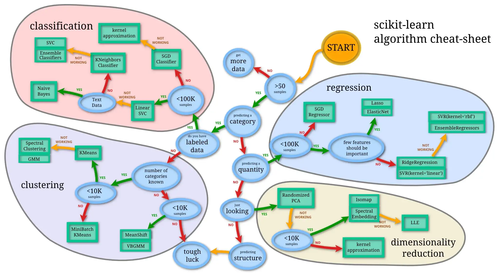

# ML Course

## Choose the right algorithm

## Topics

**Supervised Learning**
- [Linear Regression](./linear_regression.md)
- [Normal Equation](./normal_equation.md)
- [Logistic Regression](./logistic_regression.md)
- [Neural Network](./neural_network.md)
- [Improvements & Debugging](./improvements_debugging.md)
- [Skewed Data](./skewed_data.md)
- [SVM](./svm.md)

**Unsupervised Learning**
- [K-Means](./k_means.md)
- [PCA](./pca.md)
- [Anomaly Detection](./anomaly.md)

**Recommender System**
- [Recommender Systems Overview](./recommender.md)

**Large Data Sets & Online Learning**
- [Stochastic/Mini Batch](./stoch_mini_batch.md)
- [Online Learning](./online.md)
