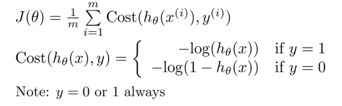
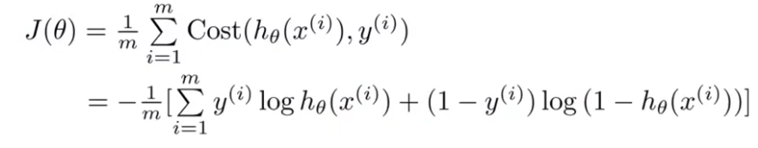
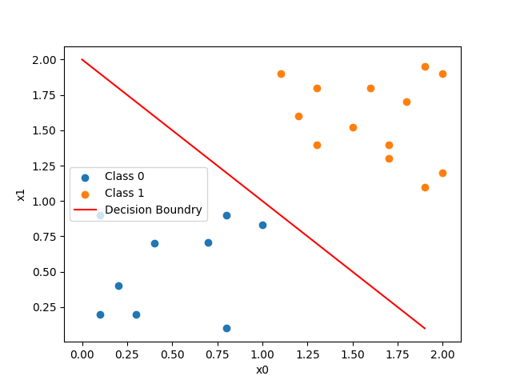
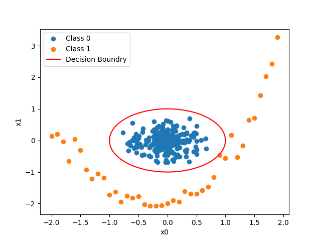

# Logistic Regression

## Example:

Get the probability of a cancer being malignant or not by the size of the
cancer.

## Approach

The data is fit into a range of `0 <= h(x) <=1` using the sigmoid function `g`
for the transpose of theta x.

```
h(x) = g(theta^T x)
z = theta^T x
g(z) = 1/(1 + e^(-z))
```

### Cost Function



This can be written as
`Cost(h(x),y) = -y log(h(x)) - (1-y) log(1-h(x))`
to have only one equations for the two cases in above.

The cost function for logistic regression can therefore be summed up
to this formula:



Here is [a basic code snippet](./snippets/logistic_regression_multi_feature.py)

### Decision Boundry

The decision boundary is the line that separates the area where
y = 0 and where y = 1. It is created by our hypothesis function.

It can be in form of a linear function like
`g(theta0 + theta1 * x0 + theta2 * x1`:



It can be more like a circle or similar with e.g.
`g(theta0 + theta1 * theta1 * x0**2 + theta2 * x1**2 )`:


